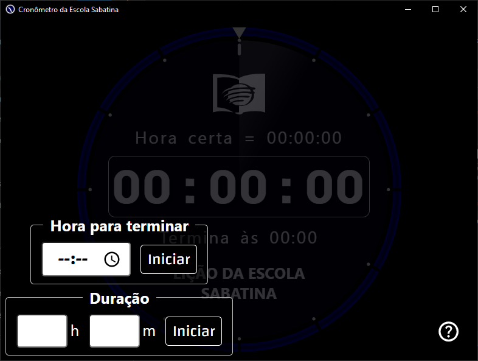
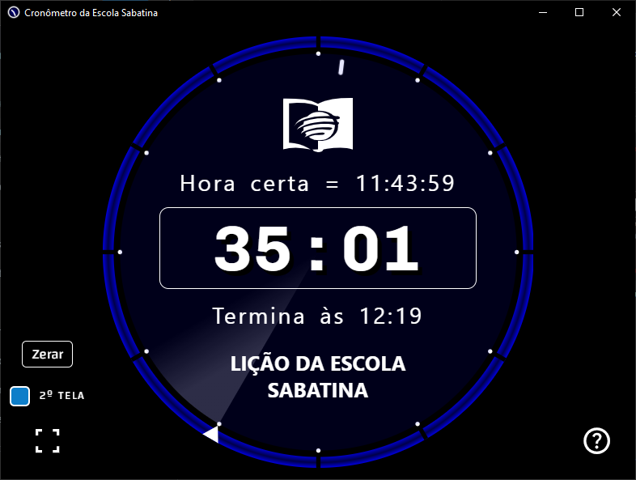
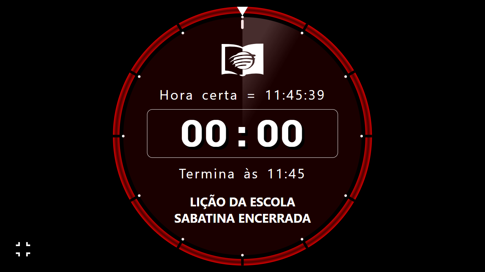

# Cronômetro da Lição da Escola Sabatina

Aplicativo desktop Windows que criei para cronometrar a lição da escola sabatina na minha igreja adventista

## Algumas imagens






## Tecnologias usadas

- HTML
- CSS
- Javascript
- Node.js
- Electron.js
- Electron Forge

## Recursos

- Digite o horário que a lição terminará ou digite quanto tempo a lição vai levar para terminar.
- Você também pode clicar ícone de relógio para abrir um menu e selecionar o horário. Use a rodinha do mouse para mudar os números.
- Depois de digitar Você pode apertar "Enter" para iniciar o cronômetro ou clicar no botão "Iniciar" correspondente a opção escolhida.
- Além do botão no canto inferior esquerdo, a tecla "F" alterna entre tela cheia e normal. Clicar 2 vezes em qualquer lugar dentro da janela depois de iniciar o cronômetro alterna entre tela cheia e normal.
- Desmarque a caixinha "2ª Tela" se não quiser que a tela cheia abra automaticamente na outra tela.
- Tecla "Esc" sai da tela cheia.
- Clicar no botão "Zerar" mostra os controles iniciais novamente e zera o cronômetro.
- Se apertar "F11" para colocar em tela cheia terá que apertar "F11" de novo quando quiser sair da tela cheia. As outras maneiras não funcionam nesse caso.
- Quando faltam 6 minutos é disparado uma notificação no Windows pra avisar que está chegando em 5 minutos.
- Com 5 minutos restantes um som de aviso é reproduzido. Também é reproduzido um som de aviso quando falta 1 minuto.
- Alguns "bips" são reproduzidos quando o cronômetro chega a zero.
- O cronômetro fecha automaticamente 1 minuto depois do tempo acabar.

> Nota: Você também pode ler sobre todas as funções clicando no botão ajuda no próprio aplicativo

## Direitos autorais

Os áudios de encerramento da lição são de criação de [Daniel Gonçalves](https://www.daniellocutor.com.br/), por isso, não inclui os áudios aqui no Github, mas você pode baixa-los neste link: https://www.daniellocutor.com.br/2009/03/audio-encerramento-da-licao-na-escola-sabatina/

Os áudios são instanciados no início do do arquivo [engine.js](./src/assets/js/engine.js) utilizando esses caminhos:

```javascript
const audio5minutos = new Audio("./assets/audios/encerramento_licao_5min.mp3");
const audio1minuto = new Audio("./assets/audios/encerramento_licao_1min_1.mp3");
const audioEncerramento = new Audio("./assets/audios/Beeper_Emergency_Call.mp3");
```

> Nota: O áudio de encerramento eu baixei da biblioteca do Youtube Studio